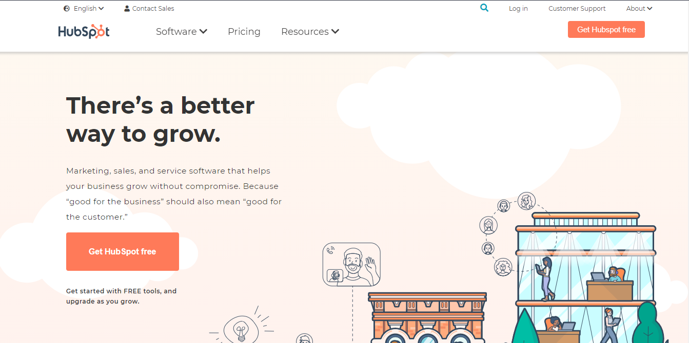

# Our Website

## www.hubspot.com/

## Team Chenab

## Screenshots

* Landing Page

### Team Members
 
- Kiran R
- Vivek Ranjan
- Shubham Sharma
- Prashanth Vengala

### Languages and Tools Used:

- HTML
- CSS
- JavaScript
- Visual Studio Code
- Git

### Pages Builds:

- HomePage
- Contact Sales
-- Book Meeting 
- Sign up & Login
- Careers
- Contact Us
- Investor Relations
- Management Team
- Get started with Hubspot

### Libraries Used :

<a href="https://fonts.google.com/">- Google Fonts</a>
<a href="https://fontawesome.com/">- Font Awesome</a>

### Summary:

Our project is to clone www.hubspot.com/ We did 10 pages Home page, Contact Sales, Book Meeting , Sign up & Login, Careers, Contact Us ,Investor Relations ,Management Team and Get started with Hubspot. We use the Font Awesome library for icons, Google Fonts library for fonts. To make it interactive with the user we use javascript language. We have also used some api in Investor Relations page to fetch dynamic data and also used localStorage property to store the users data for Login and scheduling the meeting.
Thanks.

### Use:

To use the project clone the repository and go inside the folder HubSpot_Clone using cd HubSpot_Clone. 
Locate the file index.html and run it in the browser.

